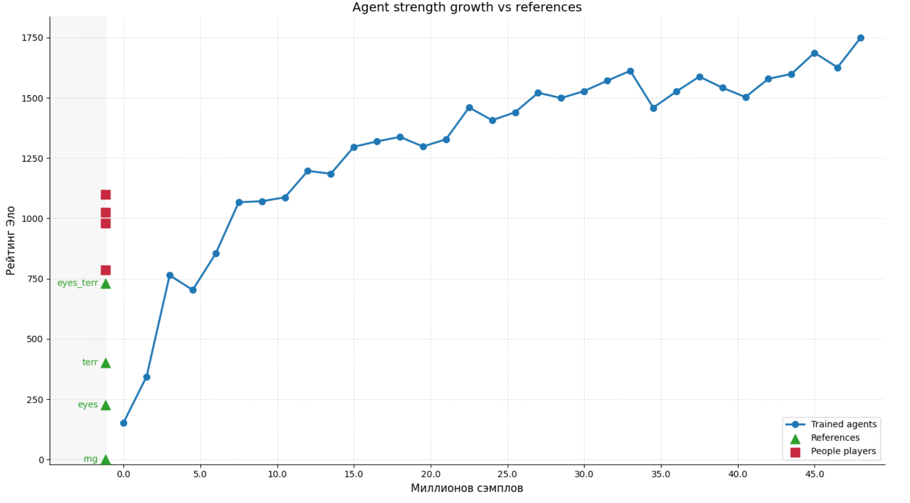

# Go of Life AI

An AlphaZero-style pipeline for training and evaluating agents that play **Go of
Life** — a two-player board game that combines Go with Conway's Game of Life.

The project implements the full loop from scratch: the game engine and its rules, a
Monte Carlo tree search guided by a residual neural network, self-play
data generation, training, and tournament-based strength evaluation between model
generations. No pre-existing engine, framework or reference implementation is used
beyond PyTorch itself.

## The Game

Go of Life extends Go with one extra action. After placing a stone, a player may run
a **life cycle**: all stones of their colour evolve by one generation of Conway's
rules — a stone with 2 or 3 same-coloured neighbours survives, any empty point with
exactly 3 same-coloured neighbours gains a stone — after which the usual capture
rules are applied. Everything else is Go: groups, liberties, captures, forbidden
suicidal placements, position repetition rules, territory scoring, komi, and a pie
rule that lets white swap colours on the first move.

Full rules with diagrams: **[RULES.md](RULES.md)**.

## Highlights

- **Game engine written from scratch**, fully JIT-compiled with Numba. Groups and
  liberties via flood fill, 256-bit Zobrist hashing, positional superko over the
  whole game history, Tromp–Taylor territory scoring.
- **Zero-copy tree search.** The board keeps a ring buffer of past positions and
  applies/undoes moves as deltas, so MCTS traverses the tree without copying board
  state.
- **KataGo-style network**: a 7-block, 96-channel ResNet with global pooling blocks,
  taking 33 input planes (32 history and lookahead planes plus a komi plane) and
  predicting policy, opponent policy, value, per-point territory ownership and final
  score.
- **Search techniques**: PUCT, Dirichlet noise at the root, playout cap
  randomization, temperature decay, early resignation and fast finish, score utility.
- **Randomized rules during self-play**: komi is sampled from a normal distribution
  and the pie rule is applied with a given probability, so a single network learns to
  play under a whole family of rule settings instead of one fixed one.
- **Distributed training pipeline** on Docker Compose: self-play workers, a batching
  inference server, a model provider, an HDF5 data writer, a GPU trainer and a
  tournament manager, all as separate services.

## Architecture

The pipeline runs as independent services that communicate over a Docker network.

| Service | Role |
| --- | --- |
| `worker` (`self_play_service.py`) | Runs self-play or tournament games. Multiple processes per container, many games in flight per process. |
| `inference_server` (`inference_service.py`) | Batches position evaluation requests from all workers and runs them on the GPU. |
| `model_provider` (`model_provider_service.py`) | Serves the current network weights to workers and the inference server. |
| `data_writer` (`game_data_writer_service.py`) | Collects finished games and writes them into an HDF5 replay buffer. |
| `trainer` (`training_service.py`) | Samples from the replay buffer, trains the network and publishes new generations. |
| `tournament_manager` (`tournament_manager.py`) | Pairs model generations against each other under fixed rules and records results for strength evaluation. |

Splitting inference into its own service is what makes CPU-side search and GPU-side
evaluation scale independently: workers stay busy expanding the tree while the
inference server keeps the GPU fed with large batches.

## Results

Training ran for ~72 hours and produced 335 network
generations from 2.35M self-play games (52M training samples).

Agent strength grew steadily across generations, measured by round-robin tournaments
between model versions under fixed tournament rules:



Training losses drop sharply over roughly the first 50 generations and then settle
into a slow decline.


A more detailed analysis — win rates as a function of komi, how often agents actually
use the life cycle, game length dynamics is in **[RESULTS.md](RESULTS.md)**.

## Quick Start

Requirements: Docker with Compose, an NVIDIA GPU with the container toolkit
installed.

Self-play training:

```bash
docker-compose --profile selfplay up --build
```

Tournament between saved generations:

```bash
WRITER_MODE=tournament WORKER_MODE=tournament \
docker-compose --profile tournament up --build
```

On Windows the same commands are wrapped in `start_selfplay.bat` and
`start_tournament.bat`.
`reset.bat` clears generated data between runs.

Data, models and training metadata are mounted from `./shared_data`,
`./shared_models` and `./training_meta`.

## Configuration

Everything tunable lives in `config.py` — board size, network shape, search budget,
komi sampling, temperature schedule, replay buffer size and training
hyperparameters. Per-game rule settings are assembled in `game_rules.py`, which
provides a randomized self-play preset and a deterministic tournament preset
(fixed komi, fixed simulation budget, no noise, no early resignation).

Training was run at `BOARD_SIZE = 9` rather than the full 19 × 19 of the rules, with
komi sampled around 4–4.5 instead of the 6.5 used on the large board.

## Repository Layout

```
board.py                 Board state, rules, captures, superko, territory, NN input planes
game.py, move.py         Game flow, move encoding/decoding
game_rules.py            Per-game rule presets (self-play / tournament)
config.py                All hyperparameters
mcts_tree.py             Search tree and node storage
mcts_agent.py            MCTS agent, PUCT, noise, temperature
mcts_agent_context.py    Per-game agent state
rollouts.py, noise.py    Search helpers
random_network.py        Baseline network for bootstrapping
train_network.py         Network architecture
train_epochs.py          Training loop
model_manager.py         Checkpointing and generation management
self_play.py             Self-play game loop
self_play_game.py        Single self-play game
init_dataset.py          Initial dataset generation
save_data.py             Replay buffer I/O
helper_functions.py      Utilities
*_service.py             Docker service entry points
notebooks/               Dataset creation, training schedule and analysis notebooks
```

## Status

The project is complete as a research experiment. Trained weights are not published
in this repository — the charts in `assets/` and the analysis in
[RESULTS.md](RESULTS.md) are the record of what the training run produced.
