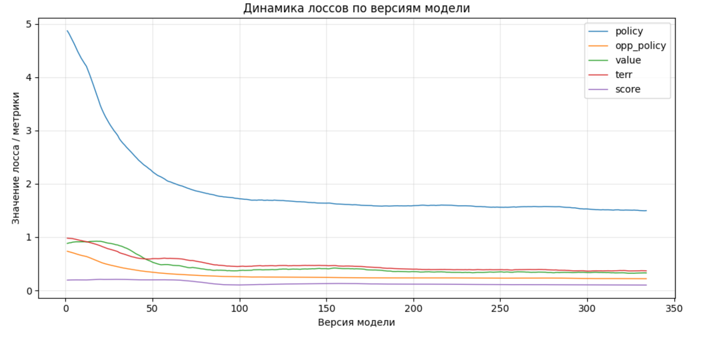
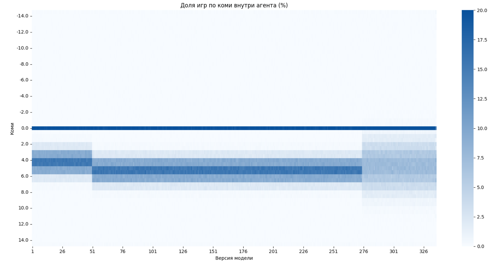
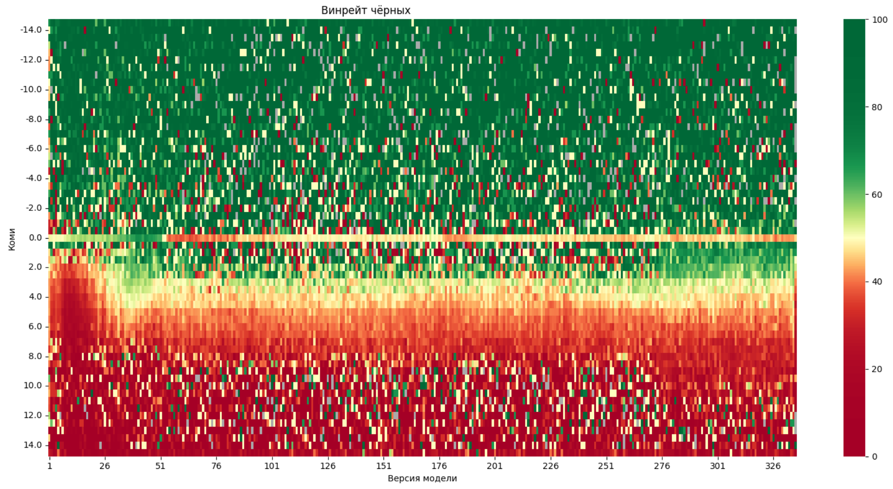
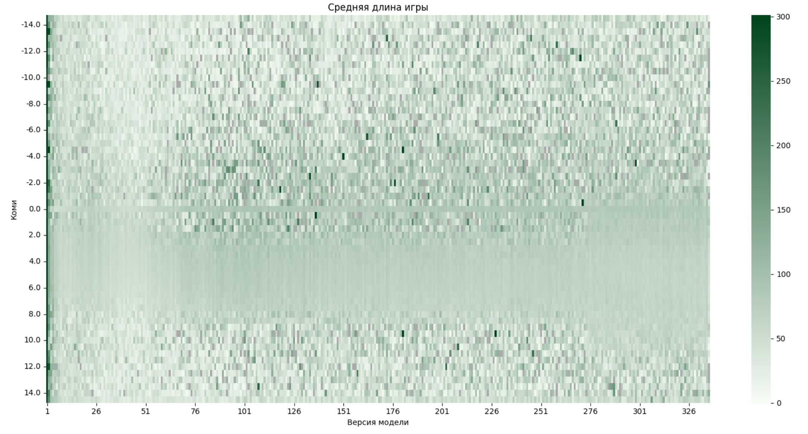

# Training Results

Analysis of a single full training run of the Go of Life agent on a 9 × 9 board.

## 1. Run Summary

| Training time | Optimizer steps | Network generations | Samples | Games |
| --- | --- | --- | --- | --- |
| 72 h | 201M | 335 | 52M | 2.35M |

## 2. Loss Dynamics

## 3. Distribution of Komi Across Games

Komi is sampled per game from a normal distribution, so games are spread unevenly
across rule settings. For the first 276 generations, more than 90% of games were
played under one of 7 rule variants out of 59 encountered in total.

The sampling settings were being adjusted during training. Early on, when black's win rate
rose noticeably, the mean komi was raised from 4 to 5, partly guided by the known
value of around 6 points in Go. In the final phase the mean was lowered to 4.5 and
the variance raised from 1 to 2, to collect more data for rule settings further from
the expected komi.

Two regions are referred to below: the **expected komi band** (values within the
sampling distribution) and the **zero komi band** (komi exactly 0, where the pie rule
applies).

## 4. Black's Win Rate vs Komi

For games that can end in a draw, the win rate counts a draw as half a win:
`wr = (W + 0.5·D) / N · 100%`.

Over the first 20 generations, results inside the expected komi band lean heavily
towards white, while the average score margin stays small — up to about 5 points —
indicating that white was winning on komi alone. In the zero komi band the earliest
agents played close to 50%. From generation 50 onwards the relationship between komi
and win rate stabilizes and changes little for the rest of the run.

The mean komi was not chosen perfectly: black's win rate stayed between 40% and 45%
throughout training, and the range closest to an even 50% was 3.5 to 4.5.

Outside the expected and zero bands, komi generally does tilt the outcome one way or
the other, but the estimates there are far noisier because of the small number of
games. Inside the expected band there is a steady win-rate gradient, which supports a
specific conclusion: once the rule settings leave the familiar range, the agent makes
worse decisions and sometimes loses even with a substantial points advantage in its
favour. Widening the expected band at the end of training did not visibly reduce
noise outside it.

In the zero komi band, where the pie rule applies, black's win rate stayed between
45% and 50% for the entire run. The pie rule compensates for the first-move advantage
effectively and keeps the game well balanced.

## 7. Game Length

Average game length stabilized quickly: by generation 2–3 the agent had learned to
pass and end games properly. By generation 50 the average settled around 75 moves and
showed no meaningful dependence on either komi or agent version afterwards,
indicating that agents play until the board is essentially filled.

This confirms the two assumptions behind the move limit: capping game length is
worthwhile, and it has little effect on training. Early generations regularly hit the
forced termination; later ones almost never did. Games longer than 150 moves are rare
enough to guarantee that tree search practically never ran into forced termination.
