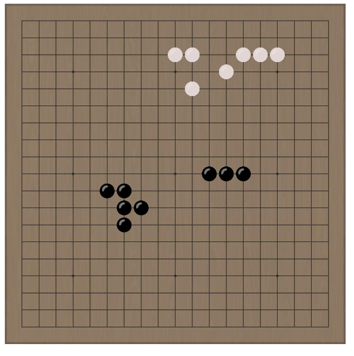
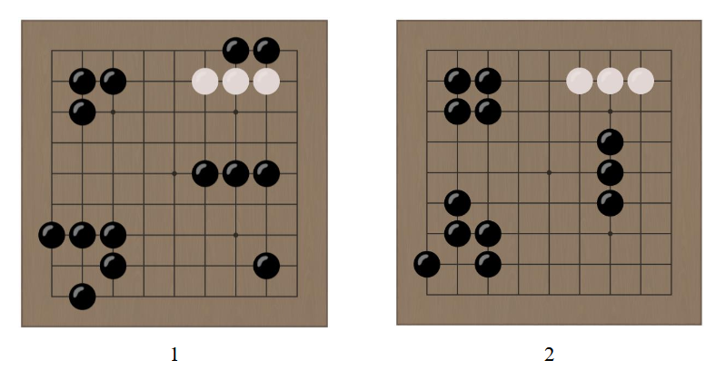
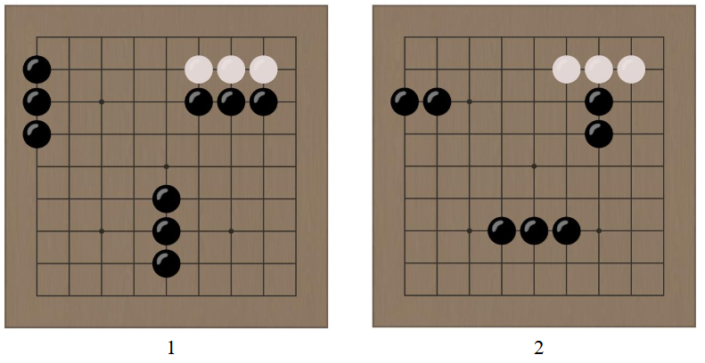
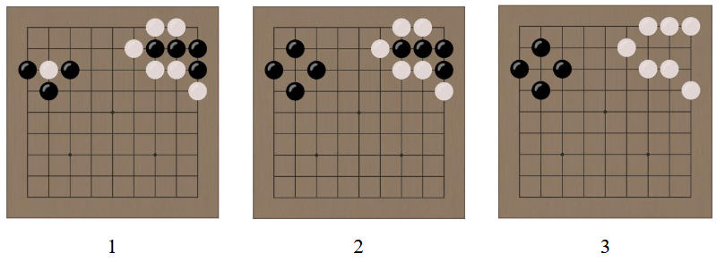
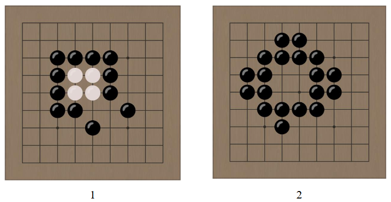
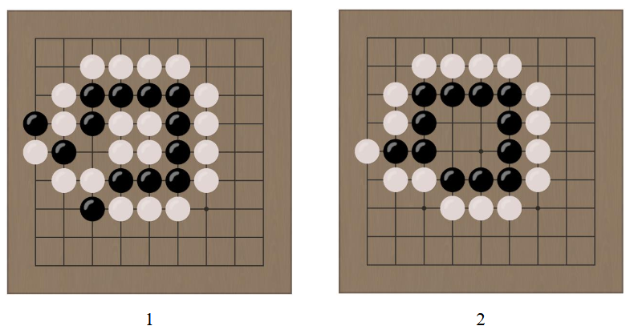
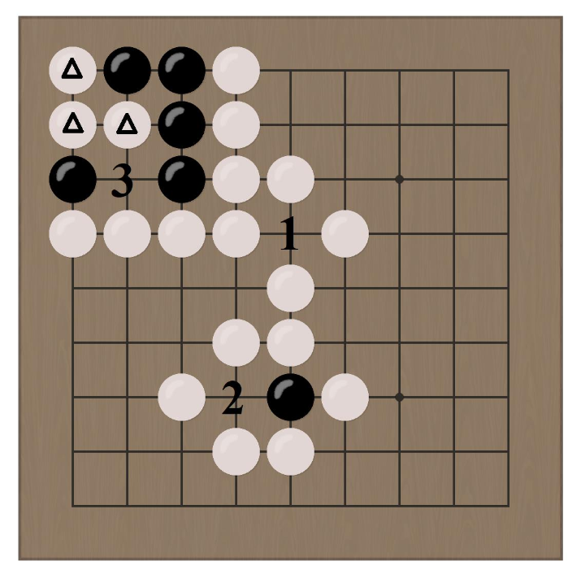
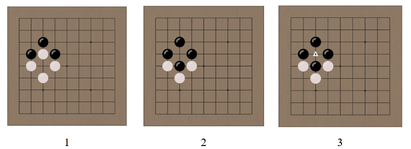
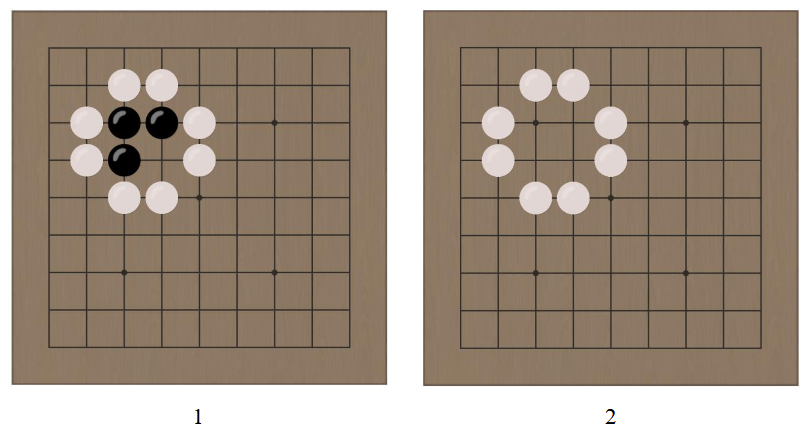
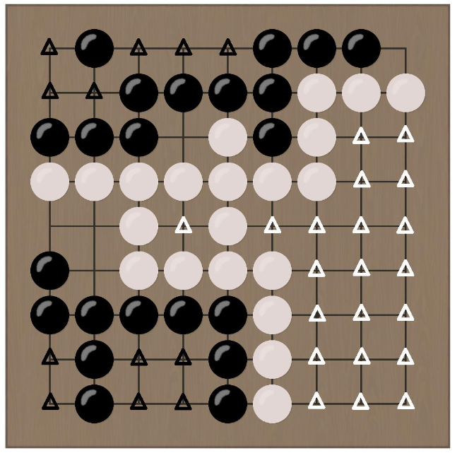

# Go of Life — Rules

Go of Life is a two-player board game that combines the rules of Go with Conway's
Game of Life. In addition to placing a stone, a player may run a *life cycle* that
evolves their own stones by cellular-automaton rules.

## 1. Overview

- The game starts with an empty board. Two players alternate placing stones of their
  own colour on the board: one plays black, the other white. Black moves first.
- After placing a stone, a player may run a **life cycle** — rearranging their own
  stones according to the rules of the game of Life.
- An opponent stone or group of stones that you surround with your own stones is
  removed from the board.
- During play, points appear where moves are not allowed: **forbidden points**.
- The game ends when both players pass in succession.
- The player who claims the most territory wins.

## 2. The Board

The game is played on a square 19 × 19 board. Stones are placed on the intersections
of the lines, called *points*, and do not move once placed.

*Fig. 1. Example position on the board*

## 3. A Player's Turn

On their turn, a player may pass and hand the turn to the opponent, or place a stone
on any unoccupied, non-forbidden point. After placing a stone, the player may either
run a life cycle or hand over the turn. Handing over the turn after placing a stone
does **not** count as a pass.

On their first turn, the white player may swap colours with the black player, which
forces the black player to answer their own opening move. In that case white's komi
transfers to black.

## 4. The Life Cycle

A life cycle rearranges the stones of a single colour on the board exactly as one
generation of the game of Life would.

*Fig. 2. Life cycle for black*

For the purposes of the life cycle, every point has the 8 points surrounding it as
its neighbours. The following algorithm is applied to every point of the board:

1. If the point holds a stone and 2 or 3 neighbouring points hold stones of the same
   colour, the stone stays on the board. Otherwise the stone is removed.
2. If the point is empty and exactly 3 neighbouring points hold stones of the same
   colour, a stone of that colour is placed on the point.

*Fig. 3. Life cycle for black. Opponent stones and the edges of the board limit the
growth of the black population.*

## 5. Capturing

A stone is removed from the board if opponent stones occupy every point connected by
a line to the point of that stone. Accordingly, to capture a group of stones, no
stone of that group may have an adjacent empty point left.

*Fig. 4. Capturing a white stone and a group of black stones*

If a group of stones ends up surrounded after a life cycle, it is removed from the
board. If two groups end up surrounded as a result of a life cycle, the group
belonging to the player who ran the cycle survives, and the opponent's group is
removed.

*Fig. 5. Capture by a life cycle. The white stones are removed from the board, but
they prevent the black stones from filling the square.*

*Fig. 6. Capture by a surrounding group. The black group survives.*

## 6. Forbidden Actions

Suicidal placements are forbidden — that is, placements that would cause a stone or a
group of stones of the current player's colour to be removed from the board. However,
if a placement would surround a group of the current player and a group of the
opponent at the same time, the action is allowed and results in the opponent's group
being removed.

*Fig. 7. Forbidden points. Black cannot place a stone on points 1 and 2; placing a
stone on point 3 is allowed and removes the marked white stones from the board.*

In addition, a player may not make an action that repeats the position as it stood
after their own previous move.

*Fig. 8. The ko rule. White cannot place a stone on the marked point.*

Suicidal life cycles are allowed.

*Fig. 9. A suicidal life cycle for black*

## 7. End of the Game and Scoring

When both players pass in succession, the game ends and scoring begins. A player
receives one point for every stone of their colour standing on the board, and one
point for every empty point entirely surrounded by their stones. On a 19 × 19 board,
white additionally receives 6.5 points as compensation for moving second (komi).

*Fig. 10. Scoring. Stones, as well as the marked points, count towards the score.
Black scores 22 for stones and 12 for territory, 38 points in total; white scores 20
for stones, 21 for territory and 6.5 points of komi compensation for black's first
move, 47.5 points in total.*
